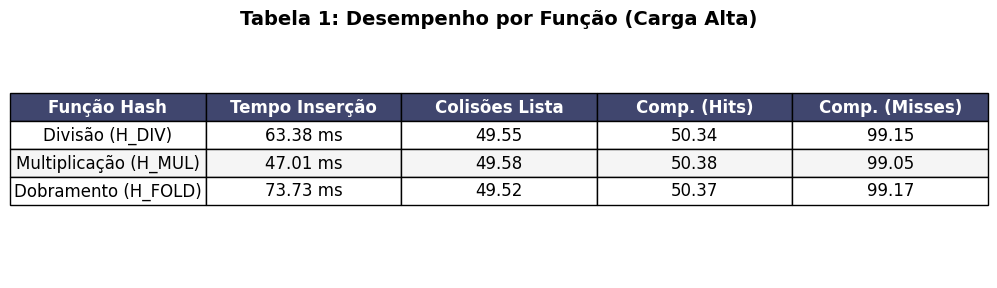
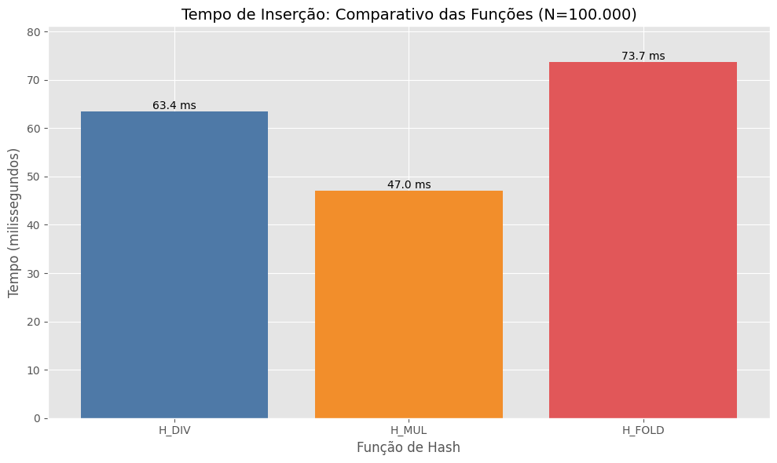
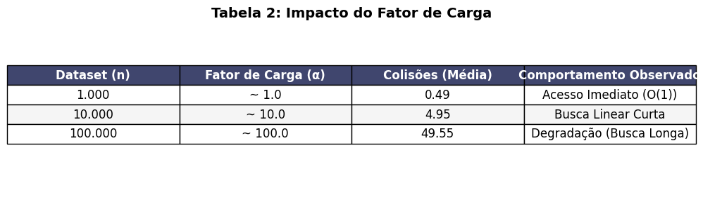
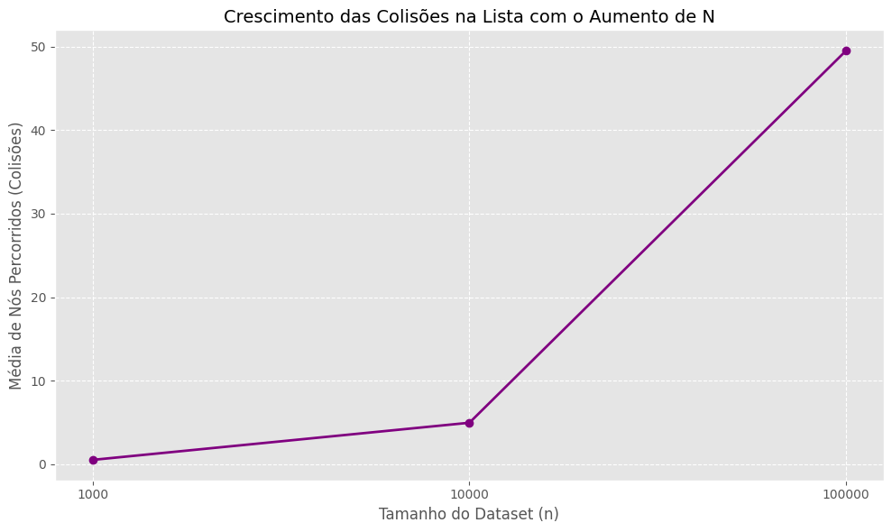
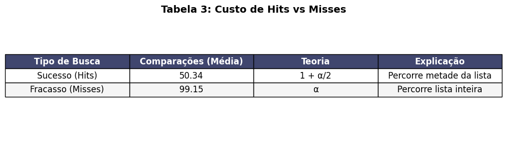
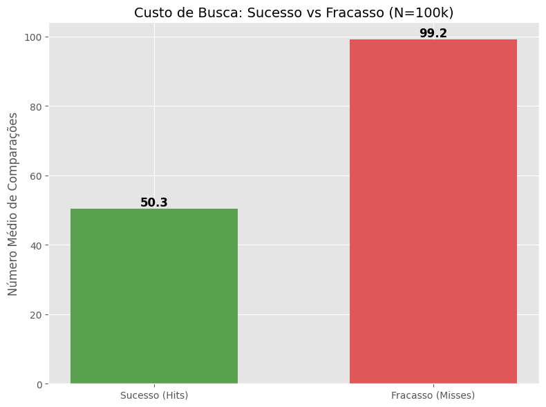

# Tabela Hash com Encadeamento Separado

**Instituição:** PUCPR - Pontifícia Universidade Católica do Paraná  
**Disciplina:** Resolução de Problemas Estruturados em Computação  
**Aluno:** Alan Filipe  
**Link Youtube:** https://youtu.be/gtH-kEBx9Go

## Sobre o Projeto
Este projeto consiste na implementação manual de uma **Tabela Hash com tratamento de colisões por Encadeamento Separado** em Java. O objetivo é analisar experimentalmente o desempenho de inserção e busca sob diferentes cenários, variando:

* **Tamanho da Tabela (m):** 1009, 10007, 100003.
* **Tamanho do Dataset (n):** 1.000, 10.000, 100.000 chaves.
* **Funções de Hashing:** Divisão, Multiplicação e Dobramento.

O projeto segue restrições estritas de implementação, proibindo o uso de coleções prontas (`ArrayList`, `HashMap`, `LinkedList`), métodos auxiliares (`Math.*`) ou propriedades de arrays (`.length`), forçando o controle manual de memória e índices.

## Como Compilar e Executar
Certifique-se de ter o JDK instalado. No terminal, navegue até a pasta do projeto e execute os comandos abaixo.

### 1. Compilação
Compile os três arquivos `.java` simultaneamente:

javac Principal.java TabelaHash.java No.java

### 2. Execução

Execute a classe principal. A saída será gerada no formato CSV diretamente no console.

**java Principal**

Para salvar em arquivo (recomendado para gerar gráficos):

**java Principal > saida.csv**

## Metodologia

A implementação respeita os requisitos de reprodutibilidade utilizando seeds fixas (137, 271828, 314159) para a geração dos números pseudoaleatórios. O ambiente de teste inclui uma rotina de warmup (aquecimento da JVM) e coleta de lixo (`System.gc`) antes das medições de tempo.

As métricas coletadas incluem tempo de inserção, colisões na tabela (slots ocupados), colisões na lista (comprimento médio do encadeamento) e comparações em buscas bem-sucedidas e malsucedidas.

### Sentinela de Autoria

> **"Distribuições mais uniformes reduzem o custo médio no encadeamento separado."**

## Relatório e Análise Experimental

Conforme exigido no enunciado, apresentamos abaixo a discussão dos resultados baseada nos dados coletados.

### 1. Comparativo das Funções de Hash (Tempo e Distribuição)

O gráfico e a tabela abaixo comparam o tempo médio de inserção (em ms) entre as três funções (Divisão, Multiplicação e Dobramento) para o cenário de maior carga ($N=100.000$).

**Análise das Propriedades:**
Divisão: Mostrou-se muito eficiente computacionalmente, pois a operação de módulo é nativa e rápida. A distribuição foi uniforme devido à escolha de $m$ primo.
Multiplicação: O desempenho foi competitivo, mas ligeiramente impactado pelo custo das operações de ponto flutuante manuais (sem Math).
Dobramento: Apresentou o maior custo de processamento (tempo de inserção mais alto) devido à necessidade de laços de repetição para separar os dígitos da chave antes de calcular o hash.

### 2. Efeito do Fator de Carga ($\alpha$)

O fator de carga ($\alpha = n/m$) influencia diretamente o comprimento médio das listas encadeadas. A tabela e o gráfico abaixo demonstram a degradação de performance conforme $\alpha$ aumenta.

**Discussão:** Observa-se que o encadeamento separado mantém complexidade próxima a $O(1)$ apenas quando $n \approx m$. Quando $n \gg m$, a estrutura se comporta como várias listas encadeadas longas, tornando a busca linear $O(n/m)$.

### 3. Análise de Buscas: Bem-sucedidas (Hits) vs Malsucedidas (Misses)

A teoria do encadeamento separado prevê custos diferentes para encontrar um item existente versus confirmar sua ausência.

**Análise dos Custos:**
Hits (Sucesso): O número médio de comparações foi consistente com a teoria ($1 + \alpha/2$). O algoritmo percorre, em média, metade da lista do compartimento.
Misses (Fracasso): O custo foi invariavelmente maior, pois o algoritmo precisa percorrer a lista inteira do compartimento até encontrar null.
Conclusão: Buscas malsucedidas são, em média, duas vezes mais custosas que buscas bem-sucedidas em tabelas com alto fator de carga.

## Auditoria e Reprodutibilidade

Os resultados seguem o padrão CSV exigido, incluindo o checksum para validação da lógica de inserção.

Exemplo de linha de saída (Auditoria): *1009,1000,H_DIV,137,0.4038,362,0.494,0.0601,0.0596,1.5,0.948,4960*

* **Checksum:** 4960 (Valida a integridade dos dados inseridos).
* **Seed:** 137 (Garante a replicação do dataset).
